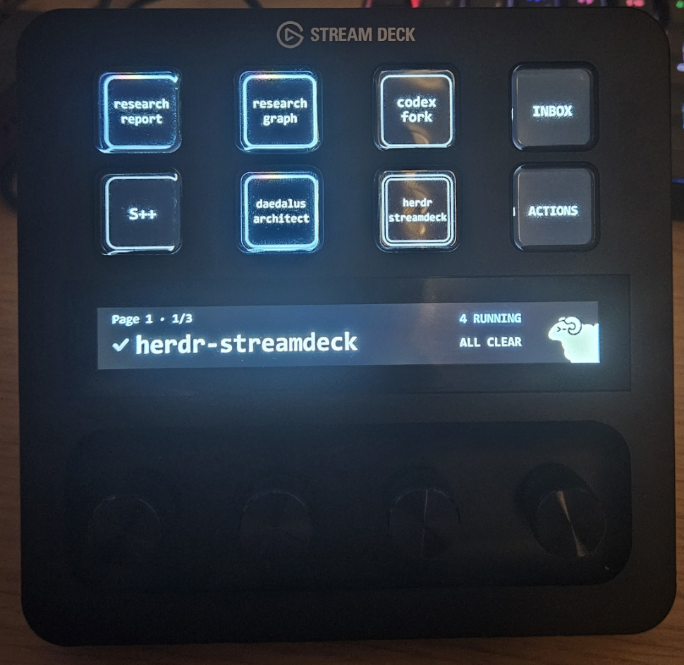

# Herdr Stream Deck+

A physical triage and control panel for [Herdr](https://herdr.dev). Pin threads, see their status, jump to anything that needs you, and send common actions without leaving the Stream Deck+.



## Install

Requires Herdr 0.8.0 or newer and a Stream Deck+.

```text
herdr plugin install Pimpmuckl/herdr-streamdeck
```

Accept the Stream Deck install prompt on Windows or macOS. Linux uses [OpenDeck](https://github.com/nekename/OpenDeck) and requires a restart after installation. macOS and Linux support is experimental and unproven.

## Use

Focus a pane in Herdr, then tap an empty thread key to pin it. Tap a pinned thread to focus it in Herdr. Hold the key to unpin it.

```text
1  2  3  INBOX
4  5  6  ACTIONS
```

| Control | What it does |
| --- | --- |
| Thread keys 1–6 | Focus, pin, or hold to unpin a thread |
| Inbox | Open or cycle through threads that need input |
| Actions | Replace keys 1–6 with Continue, Status, Verify, Zoom, unused, and Stop; press Stop twice to confirm |
| Dial 1 | Change pinned page; while Inbox is open, cycle its items; press to return to Page 1 |
| Dial 2 | Focus the selected Inbox thread |
| Dial 3 | Adjust working-animation speed; press to change the idle display |
| Dial 4 | Open and navigate settings; press to edit or finish, hold to exit |

## License

Plugin code is [MIT licensed](LICENSE). Herdr-derived themes and brand assets remain under Herdr's terms; see [third-party notices](THIRD_PARTY_NOTICES.md).
